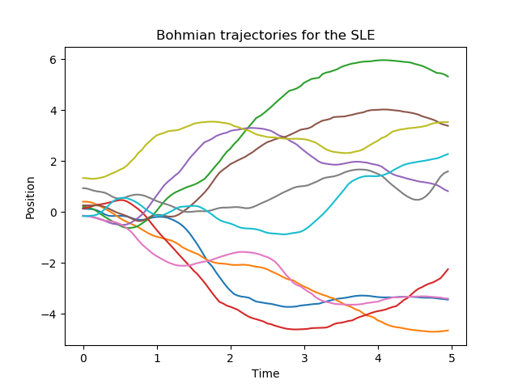

# SLE

A numerical solver for the Schrödinger-Langevin equation. It solves the SLE with colored noise and also computes the Bohmian trajectories associated with it.
See the file readme.ipynb for a quick description or the preprint https://arxiv.org/abs/1504.08087 by R. Katz and P. B. Gossiaux for a detailed discussion.

## Trajectories example
Ten Bohmian trajectories of a harmonic oscillator solved for A=1 and BETA=0.1.

